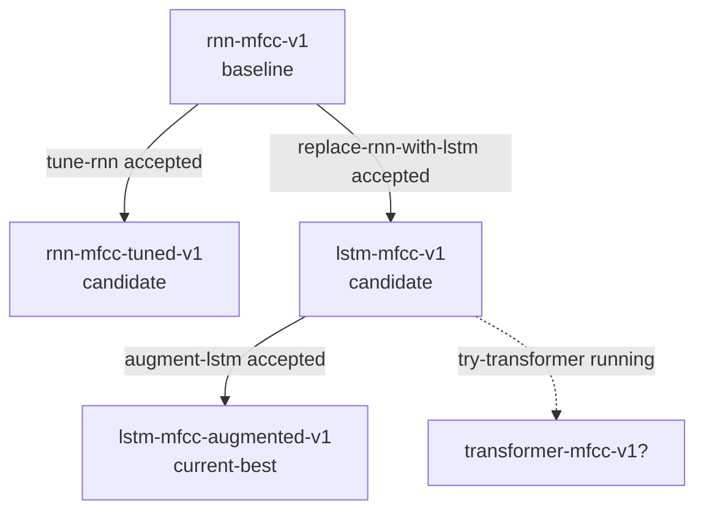
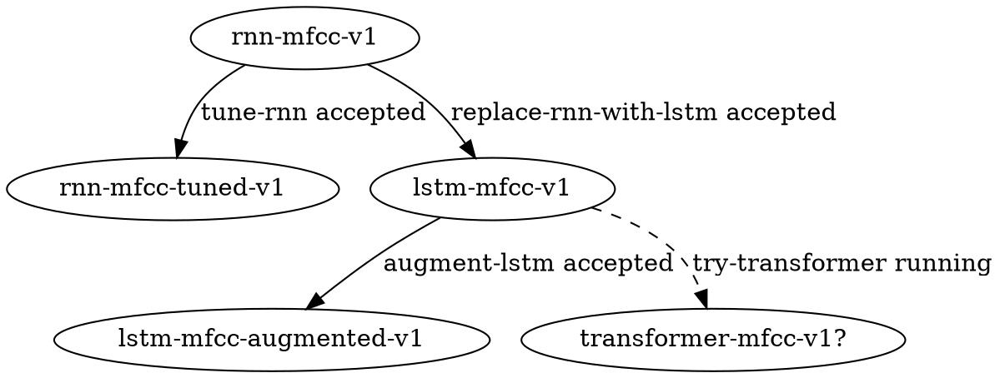

# mlspec-v2-graph-commands Specification

## ADDED Requirements

### Requirement: mlspec graph Command Formats

The system SHALL provide `mlspec graph` command with format options.

#### Scenario: Graph default is text format
- **WHEN** user runs `mlspec graph`
- **THEN** output SHALL be text format (same as `mlspec graph --format text`)

#### Scenario: Graph supports text format
- **WHEN** user runs `mlspec graph --format text`
- **THEN** output SHALL be a robust, agent-readable listing:

```
Recipe graph

Recipes:
  rnn-mfcc-v1 [baseline]
  rnn-mfcc-tuned-v1 [candidate]
  lstm-mfcc-v1 [candidate]
  lstm-mfcc-augmented-v1 [current-best]

Lineage:
  rnn-mfcc-v1 -> rnn-mfcc-tuned-v1
  rnn-mfcc-v1 -> lstm-mfcc-v1
  lstm-mfcc-v1 -> lstm-mfcc-augmented-v1

Experiments:
  tune-rnn: rnn-mfcc-v1 -> rnn-mfcc-tuned-v1 [accepted]
  replace-rnn-with-lstm: rnn-mfcc-v1 -> lstm-mfcc-v1 [accepted]
  augment-lstm: lstm-mfcc-v1 -> lstm-mfcc-augmented-v1 [accepted]
  try-transformer: lstm-mfcc-v1 -> transformer-mfcc-v1? [running]
```

#### Scenario: Graph supports mermaid format
- **WHEN** user runs `mlspec graph --format mermaid`
- **THEN** output SHALL be valid Mermaid flowchart:



#### Scenario: Graph supports dot format
- **WHEN** user runs `mlspec graph --format dot`
- **THEN** output SHALL be valid DOT for Graphviz:



---

### Requirement: mlspec lineage Command

The system SHALL provide `mlspec lineage <recipe-id>` command to show recipe ancestry.

#### Scenario: Lineage shows ancestry chain
- **WHEN** user runs `mlspec lineage rf-mfcc-v1`
- **THEN** output SHALL show:
  ```
  Recipe: rf-mfcc-v1
  Parent: svc-mfcc-v1
  Created by: rf-from-svc

  Ancestry:
    rf-mfcc-v1
      └── svc-mfcc-v1 (baseline)
  ```

---

### Requirement: mlspec diff Command

The system SHALL provide `mlspec diff <recipe-a> <recipe-b>` command to compare two recipes.

#### Scenario: Diff shows config differences
- **WHEN** user runs `mlspec diff rf-mfcc-v1 rf-mfcc-roi-v1`
- **THEN** output SHALL show differences in `config`:
  ```
  --- rf-mfcc-v1
  +++ rf-mfcc-roi-v1

  model:
    type: random-forest
    n_estimators: 200

  +preprocessing:
  +  - add_roi_cropping
  ```

---

### Requirement: mlspec next Command

The system SHALL provide `mlspec next` command as read-only router.

#### Scenario: Next recommends highest priority action
- **WHEN** user runs `mlspec next`
- **THEN** output SHALL include:
  - Recommended next action (with skill command)
  - Why this action is recommended
  - Context: current-best, active experiments, pending resolutions

#### Scenario: Next uses priority logic
- **WHEN** determining next action
- **THEN** priority SHALL be:
  1. Experiments with failed abort criteria
  2. Experiments with complete evidence awaiting resolution
  3. Experiments with partial evidence (smoke complete, need validation)
  4. Experiments awaiting retry
  5. Suggest exploration if no clear next action

---

### Requirement: Lightweight Implementation

Graph commands SHALL use filesystem + YAML, not a graph database. If graph algorithms are needed, a small library like `@dagrejs/graphlib` MAY be used.

#### Scenario: Graph built from workspace files
- **WHEN** `mlspec graph` runs
- **THEN** it reads recipe files and experiment files from workspace
- **AND** constructs graph in memory from `parent_recipe` and `base_recipe` fields
- **AND** does not require external graph database

---

### Requirement: Validation Warnings for Graph

The system SHALL warn on graph anomalies.

#### Scenario: Multiple current-best warning
- **WHEN** `mlspec validate` runs
- **AND** multiple recipes have `current-best` tag
- **THEN** warning SHALL be shown

#### Scenario: Orphan recipe warning
- **WHEN** recipe has `parent_recipe` that doesn't exist
- **THEN** error SHALL be shown "Orphan recipe: X references non-existent parent Y"
